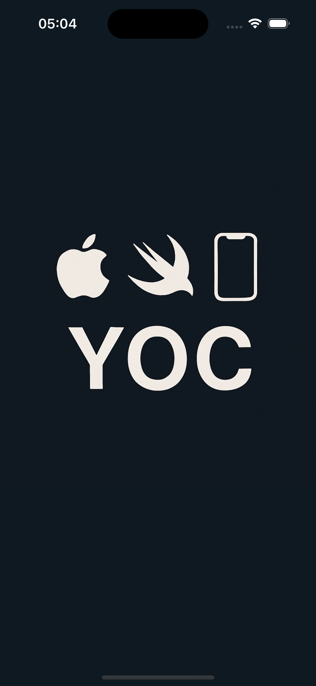
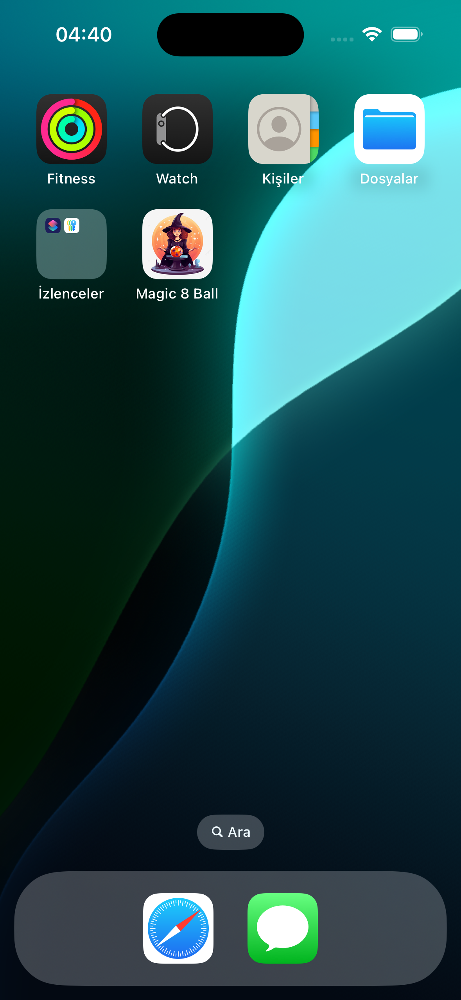
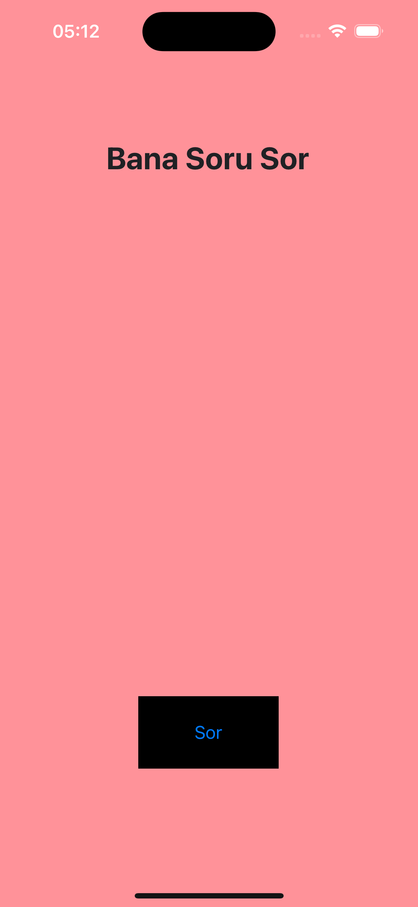
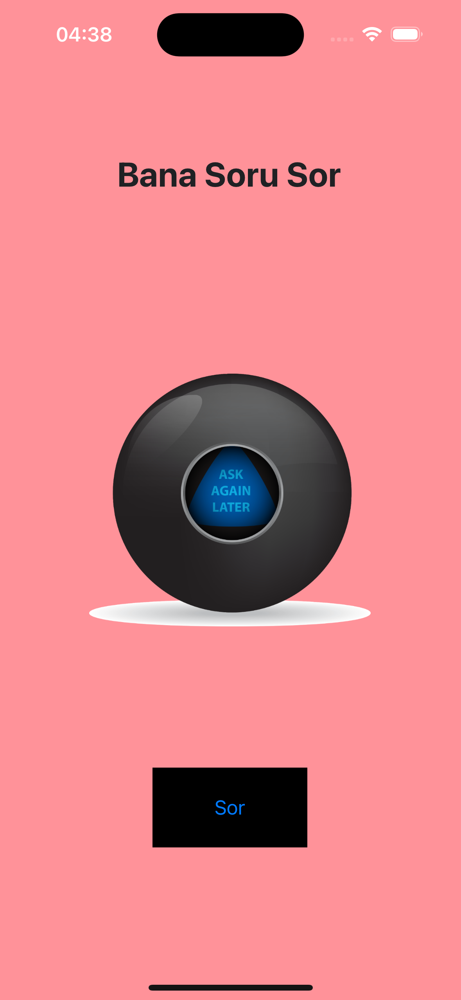

# 🎱 Magic 8 Ball – iOS App

**Magic 8 Ball** is a simple and fun iOS app that lets you ask any yes-or-no question and get an instant, mysterious answer — just like the classic Magic 8 Ball toy!

---

## 📱 How It Works

1. Launch the app.
2. Think of a yes-or-no question.
3. Tap the **"Sor"** button (meaning "Ask" in Turkish).
4. Receive a randomized answer: **YES**, **NO**, or **ASK AGAIN LATER**.

---

## ✨ Features

- Clean and intuitive UI
- Turkish localized button
- Realistic Magic 8 Ball design
- Random answer generation
- Native iOS app built with Swift & Xcode

---

## 🧪 Preview

### 🔵 Splash Screen


### 🧙‍♀️ App Icon


### 📲 App Screens

| Ask a Question | YES | ASK AGAIN LATER | No|
|----------------|-----|-----------------|---|
|  |  |  |  |

---

## 🚀 Getting Started

To run the project locally:

1. Clone the repository:
   ```bash
   git clone https://github.com/YOUR_USERNAME/Magic_Ball.git
